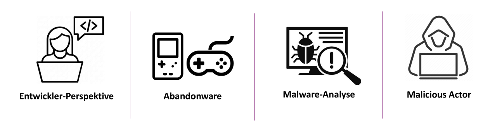
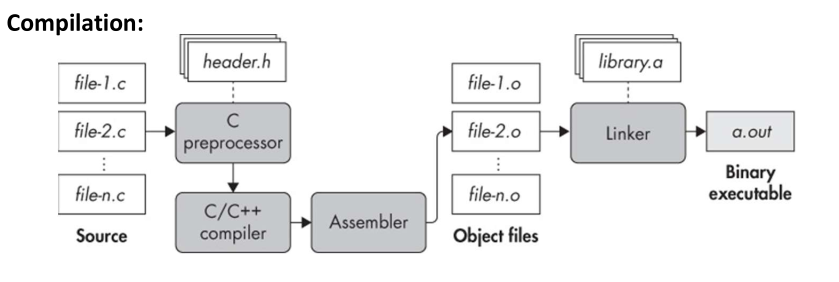
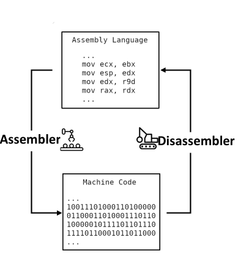
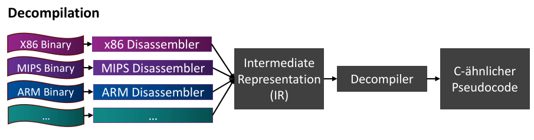
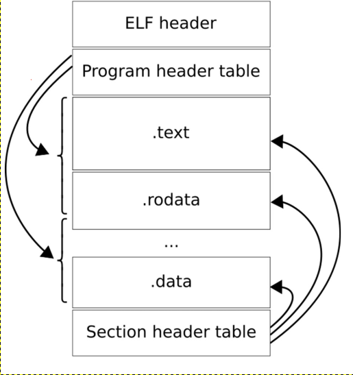

# Grundlagen

## Inhalte
1. [Was ist Remote Code Execution (RCE)?](#was-ist-remote-code-execution-rce)
   - [Angriffstypen](#angriffstypen)
   - [Injection](#injection)
   - [Deserialization](#deserialization)
   - [Memory Corruption](#memory-corruption)
   - [Gemeinsamkeiten](#gemeinsamkeiten)

2. [RCE-Schwachstellen in Binaries](#rce-schwachstellen-in-binaries)

3. [Was ist Reverse Engineering (RE)?](#was-ist-reverse-engineering-re)
   - [Schwierigkeit von RE](#schwierigkeit-von-re)
   - [Motivation hinter RE](#motivation-hinter-re)

4. [Source <-> Binary](#source2bin)
   - [Compilation – vom Quellcode zum Assembler](#compilation---vom-quellcode-zum-assembler)
   - [Assembly & Linking – von Assembler zu Binärdatei](#assembly--linking---von-assembler-zu-binärdatei)
   - [Disassembly – zurück zu Assembler](#disassembly--zurück-zu-assembler)
   - [Decompilation – zurück zu C-ähnlichem Code](#decompilation---zurück-zu-c-ähnlichem-code)
   - [Zusammenfassung](#zusammenfassung)

5. [Linux ELF-Binaries – Aufbau & Analyse](#linux-elf-binaries--aufbau--analyse)
   - [ELF Header](#elf-header)
   - [Sections – logische Struktur](#sections--logische-struktur)
   - [Program Header Table (Segmente) – für die Ausführung](#program-header-table-segmente--für-die-ausführung)
   - [Symboltabellen & Stripped Binaries](#symboltabellen--stripped-binaries)
   - [Zusammenfassung](#zusammenfassung-1)

6. [Referenzen](#referenzen)


## Was ist Remote Code Execution (RCE)?
Remote Code Execution (RCE) ist eine kritische Sicherheitsschwachstelle, die es einem Angreifer ermöglicht, beliebigen Code aus der Ferne auf einem Zielsystem auszuführen, ohne physischen Zugriff oder Nutzerinteraktion.
RCE ist eine spezialisierte Form von **Arbitrary Code Execution (ACE)**. ACE umfasst jede Form von beliebiger Codeausführung (Local & Remote), während **Remote Code Execution (RCE)** ausschließlich über Netzwerkzugang erfolgt.

Die meisten Quellen reden von drei typischen Angriffstypen: Injection, Deserialization, Memory Corruption.


### Angriffstypen:
| **Angriffstyp**       | **Schwachstellen / Vorgehen**                                                 | **Schutzmaßnahmen**                                              |
| --------------------- | ----------------------------------------------------------------------------- | ---------------------------------------------------------------- |
| **Injection**         | Ungefilterte Eingaben führen zur direkten Einbindung in Befehle / SQL-Queries | Input-Validierung, Prepared Statements, Whitelist                |
| **Deserialization**   | Manipulierte Objekte lösen Hooks aus oder aktivieren native Methoden          | Safe-Deserialization-Libraries, Whitelist-Strategien             |
| **Memory Corruption** | Buffer Overflow, Out-of-Bounds-Writes überschreiben Speicher/ Rücksprungadressen        | Sichere APIs, Compiler-Schutzmechanismen (Canary, NX, ASLR, PIE) |


---


### Injection:
Injection-Angriffe entstehen, wenn ein Angreifer ungeprüfte Eingaben direkt in einen Befehl einfügen kann, der dann vom System (z. B. SQL-Interpreter, Shell) ausgeführt wird.
Am bekanntesten ist SQL-Injection, aber es existieren auch OS Command-, LDAP-, oder XML-Injections.

Ein Webformular fragt den Benutzernamen ab:

```sql
SELECT * FROM users WHERE username = '$input';
```

Angreifer gibt ein:
```sql
' OR '1'='1
```

Wodurch der Befehl wird zu:
```sql
SELECT * FROM users WHERE username = '' OR '1'='1';
```

Damit werden alle Benutzer zurückgegeben, ohne Login oder Passwortprüfung.


---


### Deserialization:
Deserialization-Angriffe entstehen, wenn eine Anwendung externe Daten in Objekte umwandelt, ohne zu prüfen, was genau deserialisiert wird.
Viele Webanwendungen nutzen Deserialisierung, um z. B. Sitzungsdaten oder Einstellungen vom Client zu laden, meist in Formaten wie JSON, XML oder binären Streams (z. B. Java-Objekte).

Wenn ein Angreifer hier eigene Objekte einschleusen kann, kann er Klassen wählen, die beim Deserialisieren automatisch Funktionen ausführen. Dabei muss kein eigener Code eingeschleust werden, sondern lediglich vorhandene Klassen genutzt werden („Gadget Chains“): Apache Commons Collections, Spring Framework, Hibernate

Ein Java-Webserver empfängt ein Base64-codiertes Objekt.
Angreifer sendet ein objektpräpariertes Payload, das bei der Deserialisierung automatisch eine Methode wie `Runtime.getRuntime().exec()` aufruft, z. B. um eine Shell zu starten.
Typische Libraries, die verwundbar waren: Apache Commons Collections, Spring, Jackson.


---


### Memory Corruption:
Memory Corruption beschreibt das Überschreiben von Speicherbereichen, was in niedrigsprachigen Programmen (z. B. C/C++) leicht passieren kann.
Klassische Beispiele sind unsauber verwaltete Speicherbereiche, wie Buffer Overflows oder Out-of-Bounds-Zugriffe, bei denen wichtige Kontrollstrukturen wie Rücksprungadressen überschrieben werden können.

```c
void vulnerable(char *input) {
    char buffer[64];
    strcpy(buffer, input); 
}
```

Wenn ein Angreifer mehr als 64 Bytes sendet, wird die Rücksprungadresse (EIP) überschrieben.
Je nach aktivierten Schutzmechanismen, ist es möglich Shellcode in der Payload zu versenden und den Programmfluss umzulenken diesen auszuführen.


---


---


### Gemeinsamkeiten:
Trotz unterschiedlicher Techniken beruhen alle drei Angriffstypen auf denselben grundlegenden Prinzipien: 
Sie beginnen mit der Einschleusung externer Daten, die vom Zielsystem unzureichend geprüft oder isoliert verarbeitet werden. 
Dadurch erhält der Angreifer die Möglichkeit, den internen Kontrollfluss der Anwendung zu manipulieren. Durch direkte Ausführung, Umleitung oder Aktivierung bestehender Komponenten. Allen Angriffen gemein ist das Ausnutzen einer Schnittstelle zwischen Daten und Logik, an der interne Sicherheit durch fehlende Trennung, Validierung oder Kontextkontrolle verletzt wird. So wird nicht zwingend neuer Code benötigt; vielmehr reicht es oft aus, bestehende Mechanismen zweckzuentfremden.

| **Merkmal**                                | **Injection**                                                               | **Deserialization**                                                   | **Memory Corruption**                                                                 |
| ------------------------------------------ | --------------------------------------------------------------------------- | --------------------------------------------------------------------- | ------------------------------------------------------------------------------------- |
| **Ziel: Codeausführung**                   | Eingaben führen direkt zur Ausführung von Code via Interpreter (SQL, Shell) | Payload-Objekte triggern Methoden wie `exec()` beim Entpacken         | Kontrolle über Rücksprungadresse oder Funktionszeiger ermöglicht Shellcode-Ausführung |
| **Einstiegspunkt: externe Daten**          | User Input, URL-Parameter, Formulardaten                                    | Serialisierte Objekte (XML, JSON, binär)                              | Benutzer-Input in Puffer, Argumente in argv                                           |
| **Fehlende Validierung**                   | Keine Input-Sanitization oder falsche Escaping-Regeln                       | Keine Filterung erlaubter Klassen / Deserialisierungs-Typen           | Keine Grenzprüfung bei Speicherzugriff (z. B. `strcpy`, `memcpy`)                     |
| **Kontrollfluss-Manipulation**             | SQL-Parser oder Shell-Interpreter verarbeitet manipulierten Ausdruck        | Methoden wie `readObject()` führen automatisch Code aus (Hooks, Libs) | Manipulierter Stack oder Heap verändert Rücksprungadresse / Funktionspointer          |
| **Nutzung vorhandener Komponenten**        | SQL-Interpreter, Bash, Systemfunktionen wie `system()`                      | Vorhandene Java-Bibliotheken und Gadget-Chains                        | Vorhandene Instruktionen im Speicher, ROP-Gadgets                                     |
| **Schwachstelle im Übergang Daten → Code** | Daten direkt in SQL/Shell eingebettet                                       | Objekte direkt ohne Kontrolle instanziiert                            | Eingabedaten landen ungeprüft in sicherheitskritischem Speicherbereich                |


---
---


## RCE-Schwachstellen in Binaries
RCE-Schwachstellen können im Quellcode erkennbar sein, zumindest für Entwickler mit Einblick in die Codebasis.
Doch wenn der Quellcode nicht verfügbar ist, wie es bei proprietärer Software oder fremden Binärdateien der Fall ist, bleibt nur die Analyse des kompilierten Binaries.

Diese Schwachstellen sind jedoch im kompiliertem Code nicht mehr unmittelbar sichtbar, da sie durch Optimierung, Obfuskation und den Verlust von Symbolinformationen (z. B. Funktionsnamen, Variablennamen) verdeckt werden.
Sie lassen sich von außen manchmal anhand auffälliger Eingabemuster oder Programmverhalten vermuten, wie durch:
- unerwartete Abstürze,
- Speicherzugriffsfehler,
- auffällige Reaktion auf bestimmte Eingaben

Doch diese Hinweise können nicht eindeutig oder gar nicht vorhanden sein. In solchen Fällen kann **Reverse Engineering (RE)** helfen, Einblicke in das Verhalten der Software auf Binärebene zu bekommen. Da Binaries das Ergebnis der Kompilation des Quellcodes sind, sind die RCE-Schwachstellen, die wir im Binary analysieren können, genau die Programmierfehler aus dem Quellcode, nur versteckt hinter Assemblersyntax.


---
---


## Was ist Reverse Engineering (RE)?
Reverse Engineering (RE) bezeichnet den Prozess der Rückführung einer Software (oder auch Hardware) in eine verständliche Darstellung ihrer inneren Struktur und Funktion, ohne Zugang zum ursprünglichen Quellcode oder zur technischen Dokumentation.

Im Kontext von Software bedeutet das:
Ausgehend von einer kompilierten Datei (also Maschinencode oder Bytecode) wird versucht, die Logik der Anwendung nachträglich zu rekonstruieren. Ziel ist es, die Funktion, den Ablauf und die Datenverarbeitung der Software zu verstehen.

Das IEEE definierte Reverse Engineering schon 1990 als „das Analysieren eines Zielsystems, um dessen Komponenten und deren Beziehungen zu identifizieren und das System in einer anderen Form oder auf höherer Abstraktionsebene darzustellen“ <a id="cite1"></a>[<a href="#ref1">1</a>].

RE versucht Instruktionen aus dem Binärcode zu extrahieren (Disassembly), diese in eine höhere, verständliche Repräsentation zu überführen (Decompilation) und daraus das ursprüngliche Verhalten der Software abzuleitenm wie Funktionsweise, Ein-/Ausgaben, Sicherheitslücken oder Kommunikationswege.

---


### Schwierigkeit von RE
Compiler abstrahieren und optimieren den ursprünglichen Quellcode, wodurch viele lesbare Strukturen (z. B. Variablennamen, Kommentare, Formatierungen) verloren gehen.

Das Resultat ist stark verdichteter Maschinencode, der schwer lesbar und analysierbar ist.
Hinzu kommt: Maschinencode ist plattform- und architekturabhängig. 

Intel x86 (32-bit), x86_64 (64-bit), ARM oder Apple M1 (ARM64), haben ein jeweils unterschiedliches Instruction Set, welches exakt defineirt, welche Binärcodes für welche Operationen stehen (z. B. „Addiere zwei Register“) und wie Speicherzugriffe, Registerverwendung und Systemaufrufe funktionieren.
Dadurch hat jede Architektur ihre eigene Instruction Set Architecture (ISA), also ihr eigenes Assembler-Sprachformat.

Beispielsweise: Ein einfacher Maschinenbefehl für x86 wie `mov eax, 1` (Register eax bekommt den Wert 1) ist in ARM `mov r0, #1`. Auch die Register-Namen, Byte-Reihenfolge (Endianness) und Calling Conventions sind unterschiedlich. 

RE muss diese Unterschiede beispielsweise beim Nachvollziehen von Funktionsaufrufen oder Stack-Layouts berücksichtigen.
Auch Exploit-Entwicklung ist direkt betroffen: So funktionieren z. B. Return-Oriented Programming (ROP) oder Buffer Overflows sehr unterschiedlich auf x86 vs. ARM, da die Rücksprung-Mechanismen und Sicherheitsfeatures abweichen <a id="cite4"></a>[<a href="#ref4">4</a>].


---
---

## Motivation hinter RE
RE wird aus verschiedenen Gründen betrieben:



### Softwareanalyse / Sicherheitssforschung
In der IT-Security wird RE eingesetzt, um Schwachstellen in fremder Software aufzudecken (Security Auditing) oder Schadsoftware zu analysieren, wie beispielsweise die Ransomware WannaCry. <a id="cite3"></a>[<a href="#ref3">3</a>]. Dabei geht es oft darum, das Verhalten eines Programms ohne Quellcode zu verstehen zur Exploit-Prävention oder Erkennung von Command-and-Control-Mechanismen. Die gleichen Techniken werden allerdings auch von Angreifern genutzt, um Sicherheitslücken zu entdecken und für Exploits und Remote Code Execution (RCEs) auszunutzen.

### Spielentwicklung und Modding
In der Gaming-Community wurde und wird RE aktiv genutzt, um Spielmechaniken, Datenstrukturen und Netwerkprotokolle eines Spiels zu verstehen. Einerseits ermöglicht das Fans und Entwicklern, Mods oder eigenge Tools zu erstellen und so Spiele zu erweitern, Fehler zu beheben oder auf anderen Plattformen lauffähig zu machen, andererseits wurde RE auch zur Entwicklung von Cheats bzw. zur Umgehung von Anti-Cheat-Systemen verwendet <a id="cite2"></a>[<a href="#ref2">2</a>].

### Digital Rights Management (DMR)
Auch in der Umgehung von Kopierschutz spielt RE eine Rolle. Das Digital Rights Management bezeichnet technische Schutzmaßnahmen, die eingesetzt werden, um digitale Inhalte wie Software, Filme oder Musik  vor unbefugtem Zugriff, Kopieren oder Weiterverbreitung zu schützen. Durch RE können die Schutzmechanismen nachvollzogen werden. In vielen Ländern, bewegen sich solche Analysen rechtlich zwischen „Fair Use“ und Urheberrechtsverletzung. Obwohl RE von DRM-Technologien in bestimmten Fällen (z. B. für Interoperabilität oder Forschung) legal sein kann, gelten sie oft als Verstoß gegen Gesetze wie den [DMCA (Digital Millennium Copyright Act)](https://www.copyright.gov/dmca/) oder die [EU-Urheberrechtsrichtlinie](https://eur-lex.europa.eu/legal-content/DE/TXT/?uri=CELEX:32019L0790). Denn mit dem Wissen kann auch der Kopierschutz entfernt werden. Dieser Vorgang ist als „Cracking“ bekannt <a id="cite4"></a>[<a href="#ref4">4</a>, S. 7]. 

### Wartung und Re-Dokumentation
Bei Legacy-Systmen ohne aktuelle Dokumentation kann RE helfen, die Funktionsweise nachträglich zu rekonstruieren und neu zu dokumentieren. Wenn Originalteile für ältere Hardware nicht mehr verfügbar sind / nicht mehr produziert werden, können die Teile (z.B. Chips) analysiert werden, um Altsysteme weiterhin betreiben und warten zu können. <a id="cite1"></a>[<a href="#ref1">1</a>, P.15].

### Wettbewerbsanalyse und technische Spionage
Unternehmen und staatliche Akteuere können RE auch nutzen, um Funktion, Design, ggf. auch Materialien von Konkurrenz-Produkten und Technologien zu analysieren, und durch das gewonnene Wissen, diese nachzubauen, selbst eigene Entiwcklungen voranzutreiben oder zu verbessern. <a id="cite1"></a>[<a href="#ref1">1</a>, P.13].

### Neugier und Lernzwecke
Nicht zuletzt ist Neugier ein großer Treiber: Viele Forscher, Hacker oder einfach Technik-Interessierte betreiben RE, um Verständnis für Systeme und Hardware-Sprache zu entwickeln. Besonders im Bereich Security Research und Capture-the-Flag (CTF) ist das ein anerkannter und wertvoller Zugang zur Technologie.


---
---

<a id="source2bin"></a>
## Source <-> Binary
Bevor man sich mit RE beschäftigt, lohnt sich ein kurzer Rückblick auf den regulären Build Prozess: Der Weg vom Quellcode zur ausführbaren Binärdatei.

Ein Binary ist ein ausführbares Programm, das vollständig in Maschinencode vorliegt und von einer bestimmten Prozessorarchitektur interpretiert werden können. Binaries entstehen durch die Übersetzung von Quellcode mittels Compiler und Linker und enthalten neben ausführbarem Code auch strukturierte Metadaten, die das Betriebssystem benötigt, um das Programm korrekt in den Speicher zu laden und auszuführen.


---


### Compilation - vom Quellcode zum Assembler
Der Build-Prozess startet mit mehreren `.c`-Dateien, die durch den **C-Preprozessor** zusammengeführt werden (`#include`, `#define`, Makros usw.). Anschließend analysiert der Compiler den Code und wandelt ihn in eine maschinennahe Darstellung um:

- Das Compiler-Frontend führt Syntaxanalyse und Semantikprüfung durch.
- Das Backend führt Optimierungen durch und erzeugt eine **Zwischendarstellung** (z. B. LLVM-IR).
- Diese wird dann in **architekturspezifischen Assembler-Code** übersetzt (z. B. x86- oder ARM-Instruktionen).

Dieser Code ist noch als Text sichtbar, aber bereits optimiert und in seiner Struktur stark verändert.


---


### Assembly & Linking - von Assembler zu Binärdatei
Der **Assembler** übersetzt die Assembler-Instruktionen in **Maschinencode** – also rohe Bytes, die direkt von der CPU ausgeführt werden können. Dabei entstehen sogenannte **Object Files** (`.o`), die:

- Maschinencode enthalten,
- symbolische Referenzen (z. B. Funktionsnamen, Variablen),
- sowie **Relocation-Informationen**.

Anschließend führt der **Linker** alle Objektdateien zusammen, löst symbolische Verweise auf externe Funktionen (wie `printf`), fügt ggf. **Startcode** ein, und erzeugt die ausführbare Datei – z. B. ein **ELF-Binary unter Linux**.

Wichtig: Es wird zwischen **statischem** und **dynamischem** Linking unterschieden. Dynamische Bibliotheken werden erst zur Laufzeit eingebunden – z. B. durch **PLT (Procedure Linkage Table)** und **GOT (Global Offset Table)**.





### Disassembly – zurück zu Assembler
Beim **Reverse Engineering** möchte man den Prozess umkehren. Ein **Disassembler** analysiert den Maschinencode und erzeugt pro Architektur das passende **Assembler-Listing** (z. B. für x86, ARM, MIPS).

Da Maschinencode lediglich eine Abfolge von Bytes ist, ist ein korrektes Verständnis der **Architektur (ISA)** und der **Segmentierung** notwendig. Tools wie `objdump` oder Ghidra erkennen Befehlsketten und erzeugen lesbare Befehlskürzel (Assembler-Mnemonics)

Allerdings fehlen viele Informationen, wie Variablennamen, Datentypen oder Kommentare, wenn diese beim Kompilieren entfernt wurden.

Wenn Debug-Informationen vorhanden sind (z. B. durch -g beim Kompilieren), enthalten Object Files und Binaries zusätzliche Symbole, was Disassemblern und Debuggern erheblich hilft. Wird jedoch „stripping“ durchgeführt, verschwinden diese Informationen.


---


### Decompilation - zurück zu C-ähnlichem Code
Decompiler wie Ghidra, RetDec oder IDA Hex-Rays gehen noch einen Schritt weiter: Sie versuchen, aus dem Maschinencode einen lesbaren, C-ähnlichen Pseudocode zu rekonstruieren.

Dazu wird der Code zunächst in eine Intermediate Representation (IR) überführt: eine plattformunabhängige Zwischensprache. Ghidra verwendet beispielsweise die Zwischensprache P-Code <a id="cite7"></a>[<a href="#ref7">7</a>]. Aus dieser IR werden dann:

- Kontrollstrukturen (if, while, switch),
- lokale Variablen,
- Funktionsgrenzen und Rückgabewerte

rekonstruiert und in einer höheren Sprache dargestellt. Obwohl die ursprünglichen Namen und Kommentare fehlen, lässt sich das Programmverhalten gut nachvollziehen.




---


### Zusammenfassung

| Schritt           | Aufgabe                             | Ergebnis                      |
| ----------------- | ----------------------------------- | ----------------------------- |
| **Preprocessing** | Makroersetzung, Includes            | Ein konsolidierter Quelltext  |
| **Compilation**   | Analyse & Optimierung               | Assemblertext                 |
| **Assembly**      | Assembler → Maschinencode           | `.o`-Dateien (Object Files)   |
| **Linking**       | Kombinieren & Adressauflösung       | Executable Binary (z. B. ELF) |
| **Disassembly**   | Maschinencode → Assembler-Mnemonics | Assembler-Listing             |
| **Decompilation** | Assembler → C-ähnlicher Pseudocode  | Pseudocode zur Analyse        |


---
---


## Linux ELF-Binaries – Aufbau & Analyse

Unter Linux werden ausführbare Programme typischerweise im **ELF-Format (Executable and Linkable Format)** gespeichert. Dieses Format organisiert die verschiedenen Bestandteile eines Programms sowohl für die **Analyse** als auch für die **Ausführung durch das Betriebssystem**. Eine ELF-Datei besteht aus mehreren Hauptbestandteilen <a id="cite5"></a>[<a href="#ref5">5</a>]:
| Bereich         | Zweck                                | Beispiel / Inhalt                          |
|----------------|---------------------------------------|--------------------------------------------|
| ELF Header      | Basisinfos zur Datei                 | Architektur, Entry Point, Offsets          |
| Sections        | Logische Programmstruktur            | `.text`, `.rodata`, `.data`, `.symtab`     |
| Segmente (PHT)  | Laufzeit-Speicheraufteilung          | RWX-Rechte, Laden durch Betriebssystem     |
| Symboltabelle   | Analyse- und Debugginghilfe          | Funktionsnamen, Variablennamen             |





---


### ELF Header
Der **ELF Header** steht am Anfang jeder ELF-Datei und enthält Metadaten zur Datei selbst <a id="cite5"></a>[<a href="#ref5">5</a>]<a id="cite6"></a>[<a href="#ref6">6</a>]:
- **Magic Number**: Erste 4 Bytes (0x7F 45 4C 46, also `0x7F ELF`) identifizieren die Datei eindeutig als ELF.
- **Architektur**: 32 oder 64 Bit (`e_class`)
- **Plattform**: z. B. Intel x86, ARM (`e_machine`)
- **Offsets**: Zeiger auf die Program Header Table (PHT) und Section Header Table (SHT)
- **Entry Point**: Startadresse des Programmcodes (z. B. `_start`)


---


### Sektionen – für die logische Struktur
Sections sind logische Abschnitte, die vom Compiler und Linker genutzt werden. Sie **dienen der Analyse, nicht der Ausführung** und werden beim Programmstart nicht direkt geladen. Eine **Section gehört immer zu einem Segment**. Verwaltet werden alle Sections im sogenannten Section Header Table (SHT). Der SHT ist eine Art Inhaltsverzeichnis für alle Sections der ELF-Datei. Jede Section hat dort einen Eintrag mit Metainformationen wie Name, Typ, Offset, Größe und Zugriffsrechten. Tools wie readelf, objdump oder Decompiler (z. B. Ghidra) greifen auf den SHT zu, um die Struktur und Symbolik der Binary zu analysieren <a id="cite6"></a>[<a href="#ref6">6</a>].

| Section      | Inhalt / Zweck                              | Zugriffsrechte      |
|--------------|----------------------------------------------|---------------------|
| `.text`      | Auszuführbarer Code                          | RX (Read, Execute)  |
| `.rodata`    | Konstanten, z. B. Format-Strings              | R (Read-Only)       |
| `.data`      | Initialisierte globale / statische Daten     | RW (Read, Write)    |
| `.bss`       | Nicht initialisierte Daten (nur reserviert)  | RW (Read, Write)    |
| `.symtab`    | Symboltabelle mit Funktions-/Variablennamen  | -                   |
| `.strtab`    | Zeichenketten für Symbole                    | -                   |


---


### Segmente – für die Ausführung
Im Gegensatz zu Sections sind **Segmente** für die **tatsächliche Ausführung** relevant. Sie werden beim Programmstart vom Betriebssystem in den RAM geladen. Segmente werden in der **Program Header Table (PHT)** definiert und enthalten die Speicherbereiche, die tatsächlich zur Laufzeit in den RAM geladen werden mit dazugehörigen **Zugriffsrechte** (R/W/X) <a id="cite5"></a>[<a href="#ref5">5</a>]<a id="cite6"></a>[<a href="#ref6">6</a>]. 
Ein Segment kann **mehrere Sections enthalten** oder auch **keine zugeordnete Section** haben (z. B. bei reservierten Stack-Segmenten)


| Segmenttyp       | Inhalt                                  | Speicherrechte |
|------------------|------------------------------------------|----------------|
| `LOAD`           | Hauptspeicherbereiche (Code, Daten)      | RX, RW         |
| `GNU_STACK`      | Stack-Segment                            | RW oder RWX    |
| `INTERP`         | Interpreter (z. B. Pfad zur libc.so)      | -              |


---


### Symboltabellen & Stripped Binaries
ELF-Dateien können zusätzliche Debug-/Analyseinformationen enthalten wie:

- `.symtab` – Symbolnamen für Funktionen und Variablen
- `.strtab` – dazugehörige Zeichenketten
- `.debug*` – ggf. weitere Debug-Infos

Diese sind **nicht erforderlich für die Ausführung**.
Werden sie entfernt (z. B. via `strip`), spricht man von einer **stripped Binary**. In solchen Fällen verwenden Analyse-Tools generische Namen wie `FUN_00123abc` <a id="cite6"></a>[<a href="#ref6">6</a>].


---
---


## Referenzen

[↩](#cite1) <a id="ref1">[1]</a> E. J. Chikofsky and J. H. Cross, "Reverse engineering and design recovery: a taxonomy," *IEEE Software*, vol. 7, no. 1, pp. 13–17, Jan. 1990. [doi:10.1109/52.43044](https://ieeexplore.ieee.org/document/43044)

[↩](#cite2) <a id="ref2">[2]</a> W. Scacchi, "Modding as an Open Source Approach to Extending Computer Game Systems," in *Open Source Systems: Grounding Research*, S.A. Hissam, B. Russo, M.G. de Mendonça Neto, and F. Kon, Eds., IFIP Advances in Information and Communication Technology, vol. 365, Springer, Berlin, Heidelberg, 2011. [https://doi.org/10.1007/978-3-642-24418-6_5](https://doi.org/10.1007/978-3-642-24418-6_5)

[↩](#cite3) <a id="ref3">[3]</a> W. Alraddadi and H. Sarvotham, "A comprehensive analysis of WannaCry: technical analysis, reverse engineering, and motivation," *International Journal of Computer Applications*, vol. 182, no. 45, pp. 1–8, 2018, [https://ieeexplore.ieee.org/stamp/stamp.jsp?tp=&arnumber=43044]

[↩](#cite4) <a id="ref4">[4]</a> E. Eilam, *Reversing: Secrets of Reverse Engineering*, John Wiley & Sons, 2011, [https://media.wiley.com/product_data/excerpt/17/07645748/0764574817-20.pdf]

[↩](#cite5) <a id="ref5">[5]</a> Linux Audit, "ELF Binaries on Linux: Understanding and Analysis," [https://linux-audit.com/elf-binaries-on-linux-understanding-and-analysis/](https://linux-audit.com/elf-binaries-on-linux-understanding-and-analysis/), accessed May 28, 2025.

[↩](#cite6) <a id="ref6">[6]</a>Github, x0nu11byt3/elf_format_cheatsheet.md, https://gist.github.com/x0nu11byt3/bcb35c3de461e5fb66173071a2379779

[↩](#cite7) <a id="ref7">[7]</a> Ghidra P-Code: https://riverloopsecurity.com/blog/2019/05/pcode/#:~:text=P,that%20work%20with%20assembly%20code