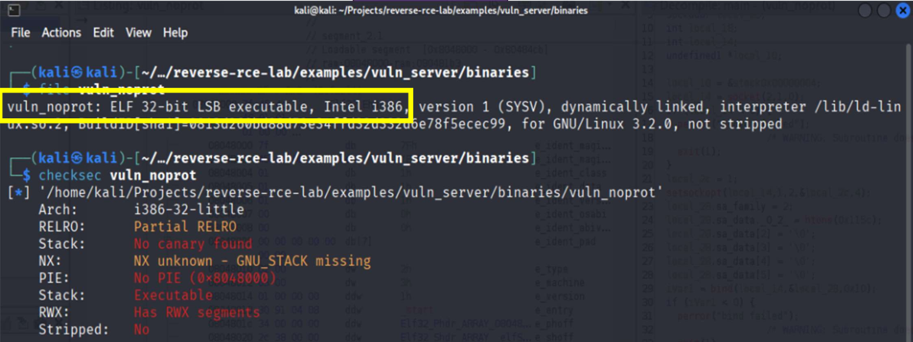

# Reverse Engineering – Übersicht

Zur Analyse einer Binärdatei mit dem Ziel, Schwachstellen zu identifizieren, stehen unterschiedliche Informationsquellen zur Verfügung. Ziel ist es, Informationen über Aufbau, Verhalten und Angriffsfläche der Binary zu sammeln, mithilfe statischer und dynamischer Techniken.

---
---

## 1. Binary beschaffen
Der erste Schritt jeder Analyse ist die Beschaffung der Binärdatei. Woher eine Binary stammt, hängt dabei stark vom Kontext ab. In der Malware-Analyse etwa liegen oft bereits verdächtige Dateien vor, etwa aus infizierten Systemen, E-Mail-Anhängen oder durch Dateiextraktion aus kompromittierten Anwendungen. 

In einem offensiven Sicherheitskontext hingegen, wie bei einem Penetrationstest oder CTF-Szenario werden Binaries häufig im Rahmen der Reconnaissance-Phase gefunden: auf öffentlich zugänglichen Servern, über Leaks oder durch direkten Zugriff auf herunterladbare Executables.

---
---

## 2. Allgemeine Informationen
Bevor eine detaillierte Analyse beginnt, sollte man sich zunächst einen Überblick über die grundlegenden Eigenschaften der Binärdatei verschaffen. Dazu gehört insbesondere, welches Dateiformat vorliegt (z. B. ELF oder PE), für welche Architektur (z. B. x86, x64, ARM) die Datei kompiliert wurde, und welche Segmente vorhanden sind, insbesondere im Hinblick auf ihre Speicherrechte (Welche Segmente sind beschreibbar, ausführbar oder nur lesbar?).

Solche Informationen lassen sich mit Standard-Tools direkt unter Linux abfragen:

| Tool              | Zweck                                        |
|-------------------|-----------------------------------------------|
| `file`            | Format & Architektur bestimmen (z. B. ELF, x86) |
| `checksec`        | Überblick über aktive Schutzmechanismen       |
| `readelf -h / -S` | ELF-Header, Sections, Segmentrechte auslesen |
| `objdump -f / -x` | Entry-Points, Segmentstruktur, Relocations    |

Gerade **checksec** ist ein zentrales Tool, um die verwendeten Schutzmechanismen der Binary auf einen Blick zu erfassen, zur Verteidigung (im Audit) oder zur Umgehungsplanung bei Exploit-Entwicklung. In unserem Beispiel war die Binary ein 32-Bit ELF Executable ohne aktivierte Schutzmechanismen, ein typisches Setup für Lehr- und Lernzwecke:

---
---

## 3. Input Tests - Erste Interaktion

Zu diesem Schritt wurde auch ein [Demovideo](videos/01_start_program.mkv) zur Eingabeanalyse aufgenommen.

Bevor man zu fortgeschrittenen statischen oder dynamischen Analysemethoden greift, kann es hilfreich sein, das Programm einfach auszuführen und verschiedene Eingaben auszuprobieren. Vor allem bei einfacheren Binaries lassen sich dadurch oft erste Auffälligkeiten entdecken, insbesondere, wenn das Programm direkt mit Nutzereingaben interagiert.

In unserem Beispiel handelt es sich bei vuln_noprot um einen kleinen TCP-Server, der auf Port 4444 lauscht. Eine Verbindung kann über Tools wie netcat hergestellt werden. Nach dem Verbindungsaufbau fragt der Server zunächst nach einem Benutzernamen und einem Passwort.

Gibt man reguläre Eingaben ein, etwa "test" und "hello", erhält man eine klare Antwort: „Access Denied“. Doch wenn man gezielt ungewöhnlich lange Eingaben testet, kann man Fehler provozieren: Während eine überlange Eingabe beim Benutzernamen weiterhin korrekt behandelt wird, führt eine überlange Passwort-Eingabe zu einem Absturz des Servers, einem Segmentation Fault. Ein solcher Absturz ist ein erster klarer Hinweis auf eine mögliche Memory Corruption-Schwachstelle, wie ein Buffer Overflow.

Dieses manuelle Austesten von Eingaben ist im Grunde eine Form des simplen Fuzzings, das gezielte oder automatisierte Testen verschiedenster Eingaben, um Fehlerzustände zu provozieren. 

Professionelle Werkzeuge wie libFuzzer, AFL oder Boofuzz können solche Eingaben systematisch und mit deutlich höherer Abdeckung generieren. Besonders effektiv ist Fuzzing in Kombination mit dynamischer Analyse, also das gleichzeitige Beobachten des Programms (z. B. mit Debugger oder Memory-Sanitizer), während Eingaben erfolgen.

---
---

## 4. Statische Analyse
Nach den ersten grundlegenden Informationen zur Binary (z. B. Architektur, Format, Schutzmechanismen) folgt die **statische Analyse**, also die Untersuchung **ohne Ausführung** der Datei.
Ziel ist, den Aufbau der Binary zu verstehen und sich dem ursprünglichen Quellcode möglichst stark anzunähern. Ein zentrales Tool dabei ist **Ghidra**, das den Maschinencode in lesbaren **C-Pseudocode** dekompiliert und auch das zugehörige **Assembler-Listing** anzeigt. 

**Typische Fragen der statischen Analyse sind**:
- Welche Funktionen existieren?
- Wie sieht der Kontrollfluss des Programms aus?
- Welche **Strings**, **Konstanten** oder **Syscalls** werden verwendet?
- Wo befinden sich kritische Variablen oder Speicherbereiche?
- Gibt es Hinweise auf Schwachstellen (z. B. unsichere Funktionen wie `gets`, `strcpy`, `read`)?

Durch Umbenennen von Variablen, Verfolgen von Funktionsaufrufen und das Navigieren durch den Code schafft man **Struktur und Übersicht**, um auch ohne Quelltextlogik Rückschlüsse auf die Funktionsweise zu ziehen.

Die statische Analyse des Binary `/examples/vuln_server/binaries/vuln_noprot` wird [hier beschrieben](../docs/03_statische_analyse.md).

---
---

## 5. Dynamische Analyse

Neben der statischen Analyse ist auch die dynamische Untersuchung des Programms essenziell. Mit Tools wie **GDB** oder **Pwndbg** lässt sich das Verhalten eines Binaries zur Laufzeit beobachten. 

Breakpoints erlauben es, das Programm Schritt für Schritt auszuführen und dabei Registerwerte, Speicherinhalte oder System- und Library-Aufrufe zu inspizieren. So können versteckte Abläufe sichtbar gemacht, Funktionsparameter geprüft und Abweichungen vom regulären Kontrollfluss erkannt werden.

Auch das Zusammenspiel mit Benutzerinput kann durch dynamische Analyse präzise nachvollzogen werden etwa, wo ein Eingabepuffer liegt oder welche Funktion bei falschen Passwörtern aufgerufen wird.

Die dynamische Analyse des Binary `/examples/vuln_server/binaries/vuln_noprot` wird [hier beschrieben](../docs/04_dynamische_analyse.md).

---
---

## 6. Informationen nutzen - Schwachstelle identifizieren

Durch die Kombination aus Header-Analyse, statischer Analyse und dynamischer Laufzeitbetrachtung lassen sich Informationen zum Programmverhalten sammeln und potentiell Schwachstellen erkennen wie ein **Buffer Overflow**:
- Header-Analyse identifiziert vorhandene oder fehlende Schutzmechanismen (ASLR, NX, RELRO usw.)
- Input-Tests (z. B. mit Fuzzing) geben Hinweise auf Crashes oder undefiniertes Verhalten
- Statische Analyse gibt Einblick in Aufbau, Variablennutzung und Codepfade
- Dynamische Analyse zeigt Laufzeitverhalten, Speicherzugriffe und Fehlerzustände

---
---

## 7. Exploit-Entwicklung

Wurde eine Schwachstelle gefunden, folgt die **Entwicklung eines Exploits**. Ziel ist, den Programmfluss zu kontrollieren und eigenen Code auszuführen, durch:

- Ermitteln des Offsets bis zum Instruction Pointer (EIP)
- Ersetzen der Rücksprungadresse durch eine Zieladresse einer bekannten Funktion (`secret( )`)
- Aufbau eines Payloads mit **Shellcode** oder **ROP-Chain**
- Einsatz von Tools wie **pwntools** zur automatisierten Ausführung

Dabei ist stets zu berücksichtigen, welche Schutzmechanismen aktiv sind und wie sie ggf. umgangen werden können. 
Die Schutzmechanismen werden [hier ausgeführt](../docs/05_schutzmechanismen.md).

