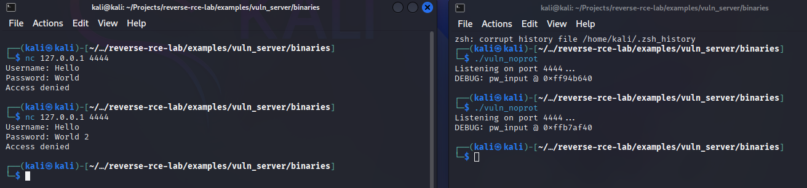
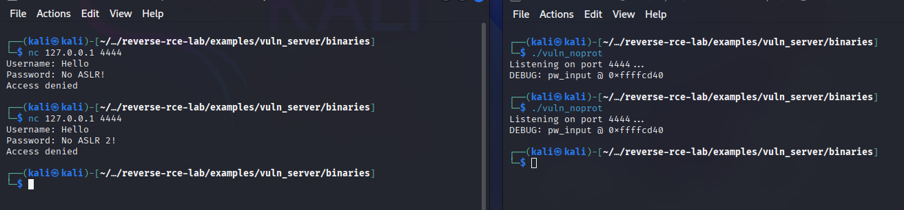
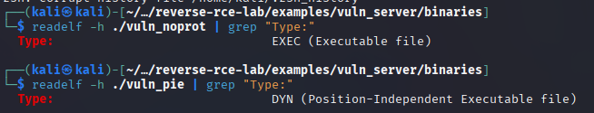
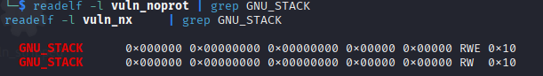
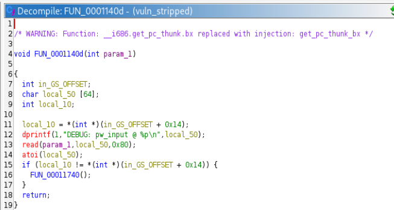
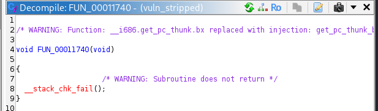
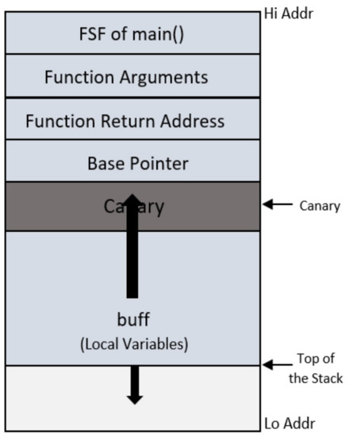

# Schutzmechanismen & Bypasses

Heutige 64-Bit-Linux-Systeme setzen standardmäßig eine Kombination von Sicherheitsmechanismen ein, um Memory-Corruption-Exploits zu erschweren. Zu den wichtigsten Mechanismen zählen ASLR, PIE, NX-Bit, Stack Canaries, sowie RELRO. Im Folgenden werden diese Schutzmechanismen erklärt, inklusive theoretischer Umgehungen.

---

## Inhalte

1. [ASLR – Address Space Layout Randomization](#aslr)  

2. [PIE – Position Independent Executable](#pie)  

3. [NX – Non-Executable Stack (No‑exec)](#nx) 

4. [Stack Canaries (Stack Canary / StackGuard / SSP)](#stack-canary)  

5. [RELRO – Relocation Read‑Only](#relro)  

6. [Zusammenfassung](#overview)

7. [Andere Schutzmechanismen](#anderes)  

8. [Referenzen](#referenzen)


---
---
<a id="aslr"></a>
## ASLR – Address Space Layout Randomization  
ASLR randomisiert die Anordnung wesentlicher Speicherbereiche eines Prozesses bei jedem Programmstart, insbesondere werden Stack, Heap, die Ladeadressen von Shared Libraries und (falls PIE genutzt wird) auch der Programmcode selbst an zufällige Adressen gelegt <a id="cite1"></a>[<a href="#ref1">1</a>].
Dadurch kann ein Angreifer nicht mehr vorab bekannte Adressen verwenden; selbst bei identischem Exploit müssen die Sprungadressen bei jedem Programmablauf neu finden <a id="cite5"></a>[<a href="#ref5">5</a>].

ASLR ist kein Schutz der spezifisch für eine Binary bei Kompilierung aktiviert werden muss, sondern ein systemweiter Schutz. Um den ASLR-Status zu prüfen, kann dieser ausgelesen werden mit: `cat /proc/sys/kernel/randomize_va_space`.
Es gibt drei Status-Werte <a id="cite5"></a>[<a href="#ref5">5</a>]:
  - 0: Keine Randomisierung
  - 1: Teil Randomisierung (Shared Libraries, Stack)
  - 2: Vollständige Randomisierung 


Wie das folgende Bild zeigt, ändert sich die geleakte Adresse bei jedem Programmstart:


Die Adresse bleibt jedoch dieselbe, wenn ASLR deaktiviert wäre:



ASLR wurde ab 2005 fest in den Linux-Kernel integriert und ist heute in allen großen Betriebssystemen aktiv
Auf 64-Bit-Systemen stehen deutlich mehr Randomisierungsbits zur Verfügung (~40 Bit unter Linux) als auf 32-Bit-Systemen (~16 Bit), wodurch das Raten von Adressen mit Brutal Force auf modernen Systemen praktisch unbrauchbar wird.

ASLR zielt vor allem darauf ab, Angriffe per Code-Reuse zu verhindern – z. B. ein return-to-libc-Angriff benötigt die Basisadresse der C-Library, die durch ASLR unbekannt bleibt <a id="cite1"></a>[<a href="#ref1">1</a>].

---

### Umgehung

Trotz der Wirksamkeit ist ASLR kein unüberwindbares Hindernis. In der Praxis kombinieren Angreifer oft mehrere Techniken, um die Adressrandomisierung zu durchbrechen.


---


#### Bruteforce-Angriffe
Auf 32-Bit-Systemen mit geringer Entropie lässt sich ASLR durch Ausprobieren aller Adresskombinationen umgehen. Der 16 Bit Zufallsraum kann in wenigen Millisekunden durchgetestet werden <a id="cite1"></a>[<a href="#ref1">1</a>]<a id="cite5"></a>[<a href="#ref5">5</a>].

Auf 64-Bit-Systemen hingegen (typisch ~40 Bit Entropie) ist Brute-Forcing nahezu unmöglich, da die enorme Versuchsanzahl Auffälligkeiten erzeugen oder vom System unterbunden würde <a id="cite1"></a>[<a href="#ref1">1</a>].

```bash
while true; do
    (python3 exploit.py) | nc 127.0.0.1 4444
done
```

Ein Spezialfall sind Dienste, die bei jedem Verbindungsaufbau in separaten Prozessen (Fork-Server) laufen: Hier könnten Angreifer in seltenen Fällen mittels wiederholter Crashes und Neustarts Adressen erraten, doch ist dies in der Praxis aufgrund der Größe des Adressraums und Gegenmaßnahmen kaum praktikabel <a id="cite1"></a>[<a href="#ref1">1</a>].

---
#### Information Leak
Deutlich erfolgreicher sind Infoleaks, also das Ausnutzen einer zweiten Schwachstelle, um Speicheradressen aufzudecken:

```c
// C-Code mit Format-String-Leak
char buf[128];
sprintf(buf, input);  // input = "%p %p %p %p %p"
puts(buf);            // Leakt Adressen vom Stack oder libc
```

Gelingt es z. B. durch eine Format-String-Lücke oder Out-of-Bounds-Read, eine Adresse aus dem Prozess (wie eine libc-Funktionsadresse) auszulesen, kann der Angreifer daraus die zufälligen Offsets berechnen <a id="cite1"></a>[<a href="#ref1">1</a>]<a id="cite5"></a>[<a href="#ref5">5</a>].

```bash
# Output z. B.:
0x0 0xf7e124f0 0xffffd030 0xdeadbeef 0x8048000
```

```python
libc_base = leaked_puts_addr - offset_of_puts
```

Mit der Kenntnis der Basisadresse einer Library oder des Hauptprogramms lässt sich ASLR somit aushebeln, da die ehemals zufälligen Adressen nun bekannt sind. Dadurch werden auch Return-Oriented Programming oder ähnliche Code-Reuse-Angriffe werden wieder möglich <a id="cite1"></a>[<a href="#ref1">1</a>].

Informationen aus dem Prozess zu leaken ist heute ein notwendiger erster Schritt bei den meisten Exploits gegen ASLR-gehärtete Programme


---


#### Attack Branch Predictors to Bypass ASLR
Auch ohne klassische Software-Schwachstelle konnte ASLR durch Seitenkanäle umgangen werden. So demonstrierte eine Studie 2016, dass ein Angreifer durch gezielte Kollisionen im CPU-Branch Target Buffer Rückschlüsse auf Adressbits ziehen kann. 
Dieser Hardware-Seitenkanal erlaubte es, die zufälligen ASLR-Offsets sowohl im Kernel, als auch im Nutzeradressraum auszulesen. Im Experiment gelang dies in etwa 60 ms auf einer Haswell-CPU <a id="cite2"></a>[<a href="#ref2">2</a>].
Solche spezialisierten Angriffe zeigen, dass selbst ASLR auf Hardware-Ebene angegriffen werden kann, obwohl sie deutlich höheren Aufwand erfordern als einfache Infoleaks.


---
---

<a id="pie"></a>
## PIE – Position Independent Executable  
PIE erweitert ASLR auf das eigentliche Hauptprogramm. Ohne PIE wird zwar der Speicher für Heap, Stack und Bibliotheken zufällig verteilt, nicht aber der Code der Haupt-Binary, der bei nicht-PIE-Programmen an einer festen Adresse (z. B. 0x400000) liegt. Diese feste .text-Adresse konnte früher von Angreifern ausgenutzt werden, indem sie Gadgets im Hauptprogramm verwendeten <a id="cite1"></a>[<a href="#ref1">1</a>]<a id="cite5"></a>[<a href="#ref5">5</a>].

Bei **Position Independent Executables** hingegen wird das Programm als Positionsunabhängiger Code kompiliert, wie eine Shared Library. Dadurch kann auch die Basisadresse der Executable bei jedem Start zufällig gewählt werden <a id="cite1"></a>[<a href="#ref1">1</a>]..

PIE-Binaries erkennt man daran, dass sie im ELF-Header den Typ `DYN` (Shared Object) haben, auch wenn sie wie normale Programme direkt ausgeführt werden können.
Das lässt sich z. B. mit `readelf -h vuln_pie` oder `file vuln_pie` erkennen:


Konkret bedeutet das, dass der Loader die Segmente an eine beliebige (randomisierte) Basisadresse lädt. Die virtuellen Adressen der Segmente wie .text, .data etc. sind damit nicht mehr fest, sondern relativ zur Ladeadresse (Base Address). Nur in Kombination ermöglichen ASLR und PIE vollständige Randomisierung aller Speicherbereiche eines Prozesses – inklusive des ausführbaren Codes <a id="cite1"></a>[<a href="#ref1">1</a>].

Moderne Distributionen wie Fedora, Ubuntu etc. übersetzen Benutzerprogramme standardmäßig als PIE, sodass sämtlicher Code (Programm und Libraries) zur Laufzeit zufällig verteilt ist
Erlaubt, dass ausführbare Dateien relativ zur Basisadresse geladen werden, um statische Adressierung zu verhindern <a id="cite1"></a>[<a href="#ref1">1</a>].  


---


### Umgehung 
PIE setzt voraus das ASLR aktiviert ist. Daher ist es trivial PIE zu umgehen, wenn ASLR deaktiviert werden kann, bzw. wenn bereis ASLR durch ein Informationsleck ausgehebelt werden kann <a id="cite5"></a>[<a href="#ref5">5</a>]. Da ohne Leak weder die Adresse von Funktionen im Hauptprogramm noch von ROP-Gadgets bekannt sind, bleibt dem Angreifer kaum anderes übrig, als zunächst eine Adresse aus dem Prozessspeicher auszulesen (häufig via GOT/PLT oder direkt aus dem Binary) <a id="cite1"></a>[<a href="#ref1">1</a>].

Hat er z. B. mittels Format-String den Base-Pointer der Executable erlangt, kann er den zufälligen Offset berechnen und dadurch die verschobenen Adressen im Hauptprogramm ableiten. Erst nach einer solchen Adressaufdeckung lässt sich ein ROP-Angriff zuverlässig durchführen. Ohne Infoleak ist die Ausnutzung eines PIE-gehärteten Programms unzuverlässig, da der komplette Adressraum des Programmcodes unbekannt ist. (Auf 64-Bit sind brute-force Versuche aussichtslos – die .text-Base hat hier ebenfalls hohen Entropiebereich, und jeder Fehlversuch würde i.d.R. den Prozess crashen.) <a id="cite1"></a>[<a href="#ref1">1</a>].

In der Praxis gilt: PIE macht ein Infoleak zur Voraussetzung für Code-Reuse-Exploits. Entsprechend wurden auch PIE+ASLR-geschützte CTF-Binaries meist über gezielte Adresslecks geknackt <a id="cite1"></a>[<a href="#ref1">1</a>].


---
---

<a id="nx"></a>
## NX – Non-Executable Stack (No‑exec)  
NX (auch als "Execute Disable" XD-Bit oder W^X bekannt <a id="cite5"></a>[<a href="#ref5">5</a>]) ist ein Hardwaremerkmal moderner CPUs, das vom Betriebssystem genutzt wird, um bestimmten Speicherseiten die Ausführungsberechtigung zu entziehen <a id="cite1"></a>[<a href="#ref1">1</a>]. 

Auf Linux/x86_64 werden dank NX Stack und Heap standardmäßig als nicht ausführbar markiert, um eingeschleusten Maschinencode daran zu hindern, zur Ausführung zu gelangen <a id="cite1"></a>[<a href="#ref1">1</a>].

Ob NX aktivier ist kann mit ebenfalls mit `readelf` geprüft werden. In diesem Fall hat `vuln_prot` wie erwartet Read, Write und Executable Rechte, `vuln_nx`, jedoch nur Read und Write Rechte:


Klassische Buffer-Overflow-Angriffe, bei denen Shellcode auf dem Stack platziert und via Überschreiben der Rücksprungadresse ausgeführt wurde, werden durch NX effektiv vereitelt. Sobald eine Speicherregion das NX-Bit gesetzt hat, führen CPU und OS dort liegende Bytes nicht als Code aus <a id="cite1"></a>[<a href="#ref1">1</a>].

Diese Technik wurde 2004 in den Linux-Kernel integriert (für AMD64 zuerst, später auch für Intel als XD-Bit) und ab ca. 2005/2006 in allen gängigen Linux-Distributionen sowie Windows (ab XP SP2) und macOS aktiviert <a id="cite1"></a>[<a href="#ref1">1</a>].

NX schließt also die bis dahin größte Sicherheitslücke: es verhindert Code Injection. Der bloße Umstand, Shellcode in einen Buffer zu schreiben, reicht nicht mehr, da dieser Code nicht mehr ausführbar ist <a id="cite1"></a>[<a href="#ref1">1</a>].

---

### Umgehung
Nachdem NX eingeführt wurde, wichen Angreifer auf Code-Reuse-Techniken aus, um dennoch Schaden anzurichten. Anstatt neuen Code einzuschleusen, wird hierbei bereits vorhandener ausführbarer Code im Prozess missbraucht. Bekannte Umgehungsmethoden sind: 

---

#### Return-to-libc
Bei dieser einfacheren Variante wird die Rücksprungadresse einer Funktion so manipuliert, dass sie auf eine vorhandene Library-Funktion (z. B. system()) zeigt. Dadurch springt das Programm in bereits vorhandenen legitimen Code, etwa um /bin/sh auszuführen, ohne neuen Code zu benötigen. Solche return-to-libc-Angriffe umgingen NX schon früh teilweise, erfordern aber genaue Kenntnis der Funktionsadresse und erlauben oft nur eine einzelne Aktion (Aufruf einer Funktion mit kontrollierten Argumenten). Moderne ASLR erschwert jedoch genau das – ohne die Basisadresse der libc lässt sich ein return-to-libc nicht zuverlässig durchführen <a id="cite1"></a>[<a href="#ref1">1</a>].

---

#### Return-Oriented Programming (ROP)
ROP ist eine Verallgemeinerung des Code-Reuse-Prinzips und wurde 2007 von Shacham et al. als systematischer NX-Bypass vorgestellt. Ein Angreifer sammelt dabei viele kurze Instruktionssequenzen aus dem vorhandenen Code, sogenannte Gadgets, die typischerweise auf einem `ret` enden und verkettet deren Ausführung, indem er gezielt Rücksprungadressen auf der Stack überschreibt <a id="cite1"></a>[<a href="#ref1">1</a>].

Durch geschicktes Aneinanderreihen dieser Gadgets entsteht ein „neues“ Programm im Rahmen der erlaubten Befehle. Mit ROP lassen sich trotz NX-Bit beliebige Operationen ausführen, bis hin zum Aufruf von `execve("/bin/sh")` für eine Shell. 
Da alle genutzten Befehle bereits im Prozess existieren (etwa in der libc oder im Programmcode selbst), verhindert NX ihre Ausführung nicht. ROP machte in den letzten 15 Jahren einen Großteil der Exploits trotz NX wieder möglich und etablierte sich als Standardmethode, um Write-Xor-Execute-Mechanismen auszuhebeln <a id="cite1"></a>[<a href="#ref1">1</a>].

Neuere Abwehrmaßnahmen wie Intel CET/Shadow Stacks zielen darauf ab, ROP wiederum zu erschweren, liegen aber außerhalb des Rahmens dieser Frage <a id="cite1"></a>[<a href="#ref1">1</a>].


---
---

<a id="stack-canary"></a>
## Stack Canaries (Stack Canary / StackGuard / SSP)
Stack Canaries (auch Stack Cookies genannt) sind kleine Wächterwerte, die der Compiler zur Laufzeit auf dem Stack platziert, um Überläufe zu erkennen <a id="cite3"></a>[<a href="#ref3">3</a>].


Konkret fügt der Stack-Smashing Protector (SSP) des Compilers direkt vor der gespeicherten Rücksprungadresse eines Funktions-Stackframes einen zufälligen Wert (den Canary) ein <a id="cite1"></a>[<a href="#ref1">1</a>]>

Beim Verlassen der Funktion (im Epilog-Code) wird dieser Wert überprüft: Der gespeicherte Canary wird mit einer Kopie des ursprünglich gesetzten Wertes verglichen. Ist der Canary verändert, so wurde offensichtlich Speicher dazwischen überschrieben. In diesem Fall bricht das Programm sofort mit einem Fehler ab, noch bevor der eigentliche `ret` ausgeführt wird. Bleibt der Canary intakt, gilt das als Beweis, dass die Rücksprungadresse nicht manipuliert wurde <a id="cite1"></a>[<a href="#ref1">1</a>]<a id="cite3"></a>[<a href="#ref3">3</a>].

In Ghidra sieht man beispielsweise diese rekonstruierte Abfrage durch den Decompiler:

`in_GS_OFFSET + 0x14` ist der Thread Local Storage (TLS) Bereich für die "stack guard", also den Canary-Wert. Der Canary liegt bei `GS:0x14` auf 32-bit Linux (bei `FS:0x28` auf 64-bit). Der Canary wird beim Funktionsstart in `local_10` gespeichert. Beim Funktionsende wird mit dem `if (local_10 != *(...))` überprüft, ob sich der Canary verändert hat. 

Da Ghidra keine Symbolinformationen besitzt, wird die `FUN` Funktion als Platzhalter angezeigt. Diese ist jedoch beim Hineinspringen genau die Standardfunktion `__stack_chk_fail()`, die ein `abort()` aufruft, wenn der Canary verletzt wird. 
:

Da ein klassischer Stackoverflow den Speicher ab einem Buffer linear überschreibt, würde er zwangsweise erst den Canary korrumpieren, bevor er an die Return Address gelangt, wie am folgenden Bild <a id="cite1"></a>[<a href="#ref1">1</a>] zu sehen:



Der Canary fungiert somit als Frühwarnsystem. Ein Pufferüberlauf, der versucht, die Rücksprungadresse zu überschreiben, würde unweigerlich den Canary zerstören und dadurch den Alarm auslösen. In modernen Implementierungen (glibc, GCC) wird der Canary bei Programmstart zufällig generiert und enthält typischerweise auch ein Nullbyte, um string-basierte Überläufe abzubrechen <a id="cite1"></a>[<a href="#ref1">1</a>].

Stack Canaries sind seit Ende der 90er (StackGuard für GCC 2.7) bekannt und heute bei den meisten Compiler-Toolchains (GCC -fstack-protector-strong, Clang etc.) standardmäßig aktiviert <a id="cite1"></a>[<a href="#ref1">1</a>].


---

### Umgehung
Ein vollständig wirksamer Canary würde bedeuten, dass ein Angreifer niemals die Rücksprungadresse überschreiben kann, ohne vorher das Programm zum Abbruch zu bringen. Stack Canaries gelten bis heute als robuste Verteidigung gegen einfache Stacküberläufe. Allerdings gibt es auch hier Umgehungsmöglichkeiten in speziellen Szenarien:

---

#### Information Leak
Wieder kann ein Information Leak helfen, einen Schutz zu umgehen. Wenn es nämlich gelingt den geheimen Canary-Wert irgendwie in Erfahrung zu bringen, kann der Angreifer, den Canary aus dem Speicher auslesen und dann bei seinem Buffer Overflow den korrekten Canary wieder an Ort und Stelle schreiben und so die Prüfung bestehen lassen <a id="cite3"></a>[<a href="#ref3">3</a>].

In diesem Fall würde der Überlauf die Rücksprungadresse ändern, ohne dass der Canary-Check Alarm schlägt – der Schutz ist umgangen. Ein praktisches Beispiel sind Format-String-Lücken, mit denen sich Werte vom Stack lesen lassen: Hierüber kann oft der Canary-Wert, der im Stackframe gespeichert ist, enthüllt werden. Informationslecks gelten daher als Hauptbedrohung für Canary-geschützte Programme. Sind sowohl ein Leak als auch ein Buffer Overflow vorhanden, lässt sich meist ein Exploit konstruieren (Leak -> Canary rekonstruieren -> dann Overflow mit korrekt eingesetztem Canary). Ohne ein solches Leak bleibt ein Canary jedoch meist undurchdringlich – einen 64-Bit-Zufallswert einfach zu erraten, ist praktisch ausgeschlossen <a id="cite3"></a>[<a href="#ref3">3</a>].

---

#### Brute-Force
Im Allgemeinen führt jeder falsche Canary sofort zum Absturz des Prozesses, und der Canary wird bei jedem Start neu zufällig festgelegt – brute-force ist somit keine Option. Eine Ausnahme besteht bei bestimmten forking Servern: Wenn ein Dienst einen Master-Prozess hat, der immer wieder Kindprozesse forked, erben alle Kinder denselben Canary (da er beim Start des Master initialisiert wurde) <a id="cite3"></a>[<a href="#ref3">3</a>].

Ein entfernter Angreifer könnte hier theoretisch den Canary Byte für Byte erraten, indem er in einem Kindprozess ein Byte des Canary überschreibt und anhand des Crashes erkennt, ob es korrekt war; über viele neue Verbindungen (viele Kinder) kann so ein Canary-Wert rekonstruierbar sein <a id="cite3"></a>[<a href="#ref3">3</a>].

Dieses Szenario erfordert jedoch, dass der Dienst bei falschem Canary nicht den gesamten Server beendet und dass der Überlauf präzise Byte-für-Byte-Steuerung erlaubt – Bedingungen, die selten gegeben sind. In der Praxis sind solche Canary-Bruteforce-Angriffe äußerst selten, wurden aber in CTFs und einzelnen Forschungen (insbesondere auf 32-Bit x86) demonstriert <a id="cite3"></a>[<a href="#ref3">3</a>]<a id="cite4"></a>[<a href="#ref4">4</a>].

Moderne Systeme setzen zusätzliche Hürden (z. B. zufällige Stack Gap oder sofortiges Beenden des ganzen Prozesses), die diesen Ansatz unattraktiv machen <a id="cite4"></a>[<a href="#ref4">4</a>].

---
---

<a id="relro"></a>
## RELRO – Relocation Read‑Only  
RELRO ist eine Build-Option, die ELF-Binaries gegen Manipulation der Global Offset Table (GOT) härtet <a id="cite1"></a>[<a href="#ref1">1</a>].
Die GOT enthält Zeiger auf Funktionen in dynamischen Libraries; bei lazy binding (Standardverhalten) sind diese Zeiger anfangs auf den dynamic linker gerichtet und werden erst beim ersten Funktionsaufruf auf die echte Adresse aufgelöst <a id="cite6"></a>[<a href="#ref6">6</a>].

Dadurch muss die GOT zur Laufzeit beschreibbar sein, was jedoch ein Exploit-Vektor ist: Ein Angreifer, der einen Write-anywhere-Primitive erlangt, konnte klassischerweise einen GOT-Eintrag (z. B. für exit() oder printf) überschreiben, um den Kontrollfluss umzubiegen (etwa auf eigenen Shellcode oder eine gewünschte libc-Funktion). RELRO schiebt diesem Trick einen Riegel vor, indem es die GOT nach der Initialisierungsphase auf Read-Only setzt <a id="cite6"></a>[<a href="#ref6">6</a>].

Das wird technisch erreicht, indem sämtliche dynamische Symbole bereits beim Programmstart aufgelöst werden (-Wl,-z,now), anstatt lazy binding zu verwenden <a id="cite6"></a>[<a href="#ref6">6</a>].

Anschließend kann der Linker die GOT-Speicherseiten auf nur-lesbar stellen. Resultat: Die Zeiger in der GOT ändern sich nicht mehr während der Laufzeit, und ein Buffer Overflow kann sie nicht mehr überschreiben <a id="cite1"></a>[<a href="#ref1">1</a>].

Man unterscheidet zwei Stufen von RELRO.


---


### Partial RELRO:
Hierbei wird zwar ein Teil der GOT schreibgeschützt (die Einträge außerhalb der PLT), doch die Einträge in .got.plt bleiben writable <a id="cite6"></a>[<a href="#ref6">6</a>].

Der dynamische Binder arbeitet weiterhin verzögert, sodass z. B. Funktionszeiger für `printf@GLIBC` & Co. erst bei Aufruf aufgelöst und in die GOT geschrieben werden. Diese lazy GOT-Einträge liegen in `.got.plt` und sind unter Partial RELRO nach wie vor veränderbar. 

Ein Angreifer kann daher – trotz aktiviertem "Partial-RELRO" – weiterhin die üblichen GOT-Overwrite-Angriffe durchführen, indem er z. B. den Zeiger einer noch nicht aufgelösten Funktion auf eine gewünschte Adresse umbiegt. Partial RELRO ordnet zwar einige Sections im Binary neu an (und stellt die nicht-PLT-GOT auf RO), bietet aber keinen Schutz gegen GOT-Manipulation über die PLT <a id="cite6"></a>[<a href="#ref6">6</a>].


---


### Full RELRO:
Beim "Full RELRO" wird die gesamte GOT (inklusive .got.plt) als readonly markiert, nachdem alle Symbole direkt zu Programmstart aufgelöst wurden <a id="cite6"></a>[<a href="#ref6">6</a>].

Dieses volle Relocation Read-Only (aktiviert via -Wl,-z,now) verhindert jegliches Überschreiben von GOT-Einträgen zur Laufzeit. Damit sind die klassischen Exploit-Techniken, bei denen etwa ein Funktionsaufruf auf eine vom Angreifer kontrollierte Adresse umgebogen wird, nicht mehr möglich <a id="cite1"></a>[<a href="#ref1">1</a>].

Full RELRO hat einen geringen Performance-Nachteil (etwas längere Startzeit durch sofortiges Binden aller Symbole) wird aber in sicherheitsbewussten Umgebungen mittlerweile standardmäßig eingesetzt (z. B. alle Fedora-Pakete ab v23 mit Full RELRO kompiliert) <a id="cite6"></a>[<a href="#ref6">6</a>].


---


### Umgehung:
Partial RELRO bietet kaum Widerstand, weil ein Angreifer praktisch wie bei einem Binary ohne RELRO verfahren kann und z. B. via Buffer Overflow einen Eintrag in `.got.plt` überschreiben kann, um Codeausführung zu erlangen. 

Full RELRO dagegen blockiert diese ganze Angriffsklasse. Wurden alle GOT-Einträge schreibgeschützt, muss ein Exploit andere Wege finden: In der Praxis weicht man dann meist auf ROP-Techniken aus (direktes Aufrufen benötigter Funktionen per ROP-Chains, anstatt über GOT-Einträge zu springen). Alternativ können falls vorhanden auch andere funktionszeiger-basierte Ansätze genutzt werden (etwa Überschreiben eines .bss-Function-Pointers, eines C++-VTables oder longjmp-Buffers), die von RELRO nicht betroffen sind. Das erfordert jedoch wiederum spezifische Schwachstellen <a id="cite1"></a>[<a href="#ref1">1</a>]. 

Full RELRO nimmt Angreifern aber einen der einfachsten und zuverlässigsten Angriffsvektoren (GOT overwrite) vollständig weg und erhöht damit die benötigte Komplexität eines Exploits erheblich.


---
---


<a id="overview"></a>
## Übersicht: Schutzmechanismen & typische Umgehungen

| **Schutzmechanismus** | **Ziel / Wirkung**                                                                 | **Typischer Bypass**                                     |
|------------------------|------------------------------------------------------------------------------------|-----------------------------------------------------------|
| **ASLR**              | Speicherbereiche (Stack, Heap, Libs) werden zufällig angeordnet – erschwert Adressvorhersage | Info-Leak, NOP-Sled, Brute-Force                         |
| **PIE**               | `.text`-Segment wird bei ELF-Typ `ET_DYN` an zufälliger Basis geladen – macht Code ASLR-kompatibel | Info-Leak + Berechnung der Basisadresse                  |
| **NX / No-Exec**      | Stack/Heap als **nicht ausführbar** markiert – verhindert direkte Shellcode-Ausführung | Return Oriented Programming (ROP)                        |
| **Stack Canary**      | Zufälliger Wert vor Return-Adresse – prüft auf Stack Overflows                      | Canary-Leak, gezielter Overflow ohne Canary-Kollision     |
| **RELRO (Partial)**   | Global Offset Table (GOT) wird teilweise schreibgeschützt – verhindert GOT-Overwrite | Nur bei *Partial* RELRO angreifbar – kein Schutz bei Full |


---
---


<a id="anderes"></a>
## Andere Schutzmechanismen

### CET & Shadow Stack (Control-flow Enforcement Technology)  
Die Control-flow Enforcement Technology ist ein Hardware-basierte Schutzmechanismus, der darauf abzielt, gezielte Manipulation des Kontrollflusses zu verhindern, wie ROP- oder JOP-Angriffe. Zu den Komponenten gehören <a id="cite5"></a>[<a href="#ref5">5</a>]:
- **Shadow Stack**: Führt eine sichere, getrennte Kopie der Rücksprungadressen (Return Addresses), um Manipulation im Hauptstack aufzudecken.
- **IBT (Indirect Branch Tracking)**: Indirekte Sprung- und Aufrufziele müssen explizit als gültig markiert sein, bevor sie ausgeführt werden können.

---

### MTE – Memory Tagging Extension (z. B. ARMv8.5+)  
MTE ist ebenfalls eine Hardware-Methode für Speicherintegrität bei ARM-Prozessoren. Jeder Speicherblock (typischerweise 16 Byte) erhält einen 4-Bit-Tag, wie jeder Zeiger im Programm. Während einer Speicheroperation müssen Tag und Zeiger übereinstimmen. Andernfalls wird der Zugriff verhindert (z. B. durch SIGSEGV). Damit schützt MTE gegen häufige Memory-Corruption-Angriffe wie Buffer Overflow oder Use After Free, da selbst geringfügige Speicherüberschreitungen zum Scheitern führen.
<a id="cite5"></a>[<a href="#ref5">5</a>]


---
---


## Referenzen
[↩](#cite1) <a id="ref1">[1]</a>  Butt, M.A.; Ajmal, Z.; Khan, Z.I.; Idrees, M.; Javed, Y. An In-Depth Survey of Bypassing Buffer Overflow Mitigation Techniques. Appl. Sci. 2022, 12, 6702. https://doi.org/10.3390/app12136702

[↩](#cite2) <a id="ref2">[2]</a> D. Evtyushkin, D. Ponomarev and N. Abu-Ghazaleh, "Jump over ASLR: Attacking branch predictors to bypass ASLR," 2016 49th Annual IEEE/ACM International Symposium on Microarchitecture (MICRO), Taipei, Taiwan, 2016, pp. 1-13, doi: 10.1109/MICRO.2016.7783743, https://ieeexplore.ieee.org/document/7783743#citations

[↩](#cite3) <a id="ref3">[3]</a> CTF Handbook, Stack Canaries, https://ctf101.org/binary-exploitation/stack-canaries

[↩](#cite4) <a id="ref4">[4]</a> Stack Canaries – Gingerly Sidestepping the Cage, https://www.sans.org/blog/stack-canaries-gingerly-sidestepping-the-cage/

[↩](#cite5) <a id="ref5">[5]</a> HackTricks: Common Binary Protections and Bypasses, https://book.hacktricks.wiki/de/binary-exploitation/common-binary-protections-and-bypasses/index.html

[↩](#cite6) <a id="ref6">[6]</a> Red Hat: Hardening ELF binaries using Relocation Read-Only (RELRO), https://www.redhat.com/en/blog/hardening-elf-binaries-using-relocation-read-only-relro